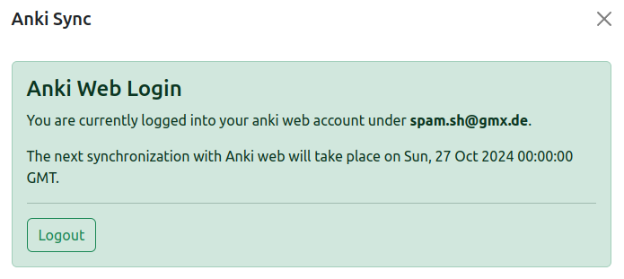
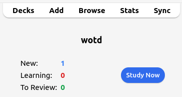
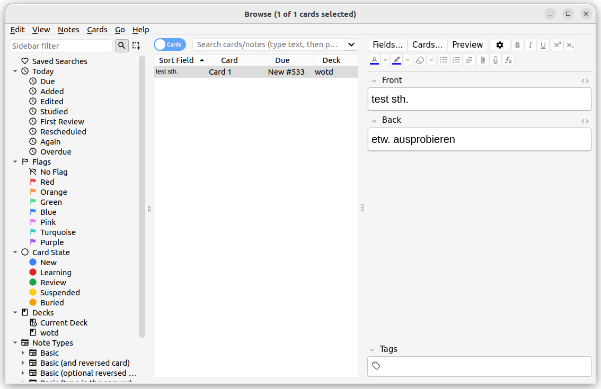

# Word of the day

## Description
This online dictionary leverages the api of [dict.cc](https://www.dict.cc/) to translate a given input word. The webapp then saves this request to a flash card for the user to learn later on. The flash card app in use is currently anki (see their [website](https://apps.ankiweb.net/)). Anki provides a mobile client as well as a webinterface which the user can interact with and learn previous requested translations.

The webapp also provides the possiblity to select other options other than the default translation for the generated flashcards.

## Usage
1. enter anki web credentials in order to sync generated flash cards with your anki account
2. select the source and target language for the translation (if both are equal we'll simply return a definition of the input word)
3. type in the word which should be translated
4. Optional: select a word which should be generated to serve as a flashcard in anki
5. learn stack in anki [web](https://ankiweb.net/about) or [client](https://apps.ankiweb.net/)

### Workflow

*Anki Login*

---

*Input Selection*

---

*Check generated card*

## Technology Used

### Languages
- [Python 3.10.12](https://hub.docker.com/layers/library/python/3.10.12-slim-bullseye/images/sha256-2daf07926ccdff5dbeef6bee46cc5bb07322f417c102609601177a1559156385?context=explore)
- [TypeScript 4.9.5](https://www.typescriptlang.org/)

### Tools / Frameworks
- [Docker 2.27.0](https://www.docker.com/)
- [Docker Compose 2.22.0](https://docs.docker.com/compose/)
- [Postgres 3.19](https://hub.docker.com/layers/library/postgres/alpine3.19/images/sha256-a2a77ae7d7ecf5e01d4a21b943933862228c715e7cd81719271c95255f5cc5ac?context=explore)
- [Flask 3.0.0](https://flask.palletsprojects.com/en/stable/)
- [React 18.2.0](https://react.dev/)

### APIs
- [Flask SocketIO 5.3.6](https://pypi.org/project/Flask-SocketIO/)
- [React Bootstrap 0.32.35](https://react-bootstrap.netlify.app/)
- [js-cookie 3.0.5](https://github.com/js-cookie/js-cookie)
- [anki-connect](https://foosoft.net/projects/anki-connect/): version 6
- [headless anki docker container](https://github.com/ThisIsntTheWay/headless-anki)

## Credits / Useful Resources

### Visualization
- [Logo](https://icon-icons.com/de/symbol/cloud-download/178873)
- Used [google font](https://fonts.google.com/specimen/Gluten?preview.text=Not%20Logged%20In%0A&preview.size=93&classification=Handwriting)
- [react fontawesome 0.2.0](https://docs.fontawesome.com/v5/web/use-with/react)

### Guides
- [guide frontend deployment](https://behdadk.medium.com/how-to-dockerize-a-react-application-in-5-minutes-c6093636628f)
- [deploying via waitress WSGI server](https://flask.palletsprojects.com/en/3.0.x/deploying/waitress/)

### Other
- [fallback deck](https://github.com/giniedp/media_education/blob/master/drehbuch/doc/resources/vocabulary/more/Vokabellisten_Englisch/Deutsch%20-%20Englisch%20Umfangreicher%20Wortschatz%20%5B18000%5D.csv)
- [dict.cc.py 3.1.0](https://github.com/rbaron/dict.cc.py)
